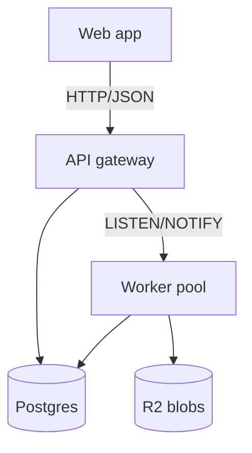
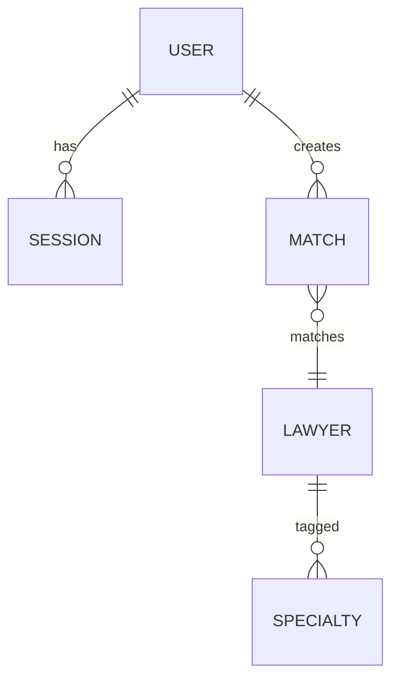
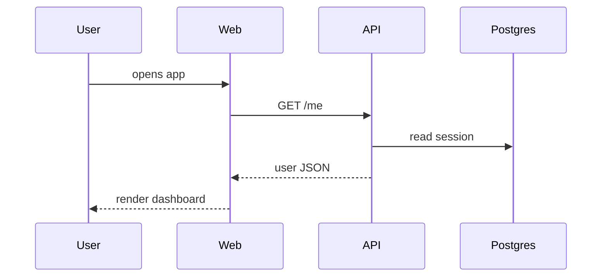

# /architect

Pipeline for a brand-new big project. Produces a single architecture doc that sits one tier above the HLD: its milestones are themselves large enough that each will later become its own `/engineer` invocation (with its own HLD).

Section-by-section. Each section: brainstorm together → write into the doc → commit → advance the `Status:` line → move on. Resume picks up at whatever `Status:` says. Two optional time-travel checkpoints inserted where decision leverage is highest.

Doc path: `docs/designs/architecture-<project>.md` (kebab-case `<project>`). Built incrementally — sections are added to the doc as they're written, not stubbed up front.

Authoring craft, diagrams, companion-doc rules, and the shared design-review loop: `~/.claude/playbooks/design-doc.md`.

Companions at arch-tier paths, same folder, created on first use: `design-stash-<project>.md`, `use-cases-<project>.md`, `workflow-lessons-<project>.md`, and the workspace's `future-<workspace>.md`. Stash tags at this tier: `[→ §<section>]` for a later section of this doc, pulled in when that section is written; `[→ <milestone>]` / `[→ cross-cutting]` for HLD/LLD-altitude detail, picked up by that milestone's `/engineer` run. A speculative idea goes to `future-<workspace>.md` even when it's milestone-related — unless it's in some milestone's plan.

## Per-section procedure

For each doc section:

1. Pull in design-stash items tagged `[→ §<this section>]`; delete them from design-stash once integrated. Then brainstorm with the human using `@~/.claude/playbooks/brainstorm.md` style — discussion, options with tradeoffs. Off-section content routes to the companions: too-low-altitude detail to design-stash, tagged `[→ <milestone>]` once milestones exist (worked examples, sample prompts, algorithm/schema specifics, cost math); behavioral scenarios to use-cases; speculative ideas to future.
2. Write the section into the doc using the template below. `git add` the doc if it's the first commit.
3. Commit with `<project>: architecture — <section>` (e.g. `myapp: architecture — software stack`).
4. Advance `Status:` to the next pipeline step in the same commit.

If the human revises an already-committed section later, commit the edit as `<project>: architecture — <section> revision`. Status stays put.

## Pipeline

0. **Setup workspace** (one-off, before any doc work) — if `.claude/context/` is missing, invoke `~/.claude/playbooks/setup.md`. It bootstraps `git init` (if needed), `.gitignore`, and `.claude/context/`. Skip silently if already set up. Not a doc section, doesn't get a `Status:` value.
1. **Overview** — what the project is, why now, who it's for, what success looks like. Ends with a short **Quality goals** subsection: top 3–5 measurable quality attributes (latency, cost ceiling, privacy posture, …).
2. **Scope** — v1 / deferred / explicitly out of scope.
3. **Use cases** — high-level capability scenarios in the doc; detailed behavioral cases (exact system responses to specific situations) → `use-cases-<project>.md`.
4. **Constraints** — budget, hosting limits (free tier?), team shape, deadlines, hard tech givens. Stated once so the stack debate doesn't relitigate them.
5. **Software stack** — language(s), framework(s), datastores, hosting/infra, key libraries, model strategy (AI/LLM only). Consult, don't decide: per major axis (language, framework, datastore, hosting), present 2–3 options with tradeoffs + a recommendation; the human picks.
6. **Key components** — top-level pieces and what each owns, plus system context: external actors/systems on the diagram's edges. Mermaid flowchart if it helps.
7. **Data model** — big nouns and relationships. Mermaid ERD if non-trivial. Skip the section entirely if the data shape is trivial enough to absorb into Key components.
8. **Cross-cutting concerns** — auth, multi-tenancy, compliance/privacy, observability, CI/CD, envs, secrets, repo+workflow.
9. **Validation gates** — existential pre-build yes/no questions the design rests on; each tagged with how to resolve (desk research / author's contacts / cheap spike) and which milestone it blocks. Implementers clear a gate before building what it blocks. Skip only if there are genuinely no load-bearing external/unknown dependencies.
10. **Time travel 1** — ask the human: *"Wanna time travel into a future where your product failed and report back?"* (The human may have unfinished thoughts on the previous section — the ask gives her space to wrap up first.) If yes, invoke `~/.claude/commands/time-travel.md`; frame target = "the `<project>` architecture as written so far"; surface the synthesis; integrate revisions into the relevant sections; fold existential pre-build unknowns the trip surfaced into Validation gates; commit as `<project>: architecture — time-travel revisions` if anything changed. If no, just advance `Status:`. Either way, no separate commit unless content changed.
11. **Key architectural decisions** — synthesis of the cross-cutting tradeoffs you actually made. Where decisions are shaped by later milestones' needs (v1 must not paint v3 into a corner), say so.
12. **Key flows** — optional. 1–3 sequence diagrams for the hottest paths. Skip if Key components already makes the flow obvious.
13. **Milestones** — arch-level milestones (each becomes its own `/engineer` run later) + coarse 100% effort split. Milestone title becomes the `<project-name>` slug for its future `/engineer` run, so pick titles that read well as kebab-case (e.g. `Backend foundation` → `backend-foundation`). Then sweep `design-stash-<project>.md`: tag each leftover section with the milestone that picks it up (`[→ <milestone>]` / `[→ cross-cutting]`); optionally tag use-cases entries by milestone too.
14. **Design review** — run `~/.claude/playbooks/design-doc.md` §G, doc type `architecture`.
15. **Time travel 2** — same prompt as step 10. Final pass before send-off, on the cleaned-up doc.
16. **Workflow-lessons sweep** — walk `workflow-lessons-<project>.md` entries with empty `- [ ] Resolution:` lines per `~/.claude/playbooks/workflow-lessons.md` (resolution = a generalizable process change or `SKIP`) and the loop in `~/.claude/playbooks/iterative-review.md`; `HANDOFF — <reason>` for global edits → append to your global config's inbox (mirrors wrap-up §3). Skip silently if the file doesn't exist.
17. **Send-off** — compose a short project-themed haiku, joke, or quote with a couple of emojis. The Claude-way bottle-break on the ship's hull. Update `Status:` to `complete`; commit as `<project>: architecture — complete`.

## Resume

Run `grep -L "Status: complete" docs/designs/architecture-*.md` to list in-flight docs. **None** → start fresh at step 0. **One** → read it, confirm "Resuming `<project>`: `Status:` = `<value>`. Go?", jump to that step. **Multiple** → list project names, ask the human to pick.

## Milestone shape

Each arch milestone needs to be big enough that an HLD is warranted — typically multiple commits of work, often a new subsystem or major slice of one.

---

## Template

*The full shape the doc grows into. Sections appear in the file only as they're written — don't stub the whole skeleton up front.*

~~~markdown
# `project` — architecture

*Italics = author instruction, delete when filling in. Plain = example/placeholder, replace.*

**Last reviewed**: YYYY-MM-DD
**Status**: Overview
**Companions**: [design-stash](design-stash-`project`.md) · [use cases](use-cases-`project`.md) · [future](future-`workspace`.md)

## Overview

1–3 paragraphs: what the whole project is, why now, the overall shape. Enough to orient reader/future-you to the system, not to any one milestone.

### Quality goals

*Top 3–5 measurable quality attributes the design optimizes for — the yardstick for stack and architecture choices below.*

1. p95 chat response under 3s.
2. Runs free-tier-only at expected load.
3. No user PII persisted beyond request lifetime.

## Use cases

*High-level capability scenarios only — one line each, user POV. Detailed behavioral cases (exact system responses to specific situations) live in the use-cases companion and accrete through later HLDs/LLDs.*

1. User finds a lawyer for their issue and books a consultation.
2. User resumes an interrupted conversation without losing context.

## Scope

*Explicit about what ships when. Forces decisions about deferral instead of letting "we'll figure it out later" stay ambiguous.*

**In scope (by milestone below):**
1. Capability (Milestone 1)
2. Capability (Milestone 2)

**Deferred / planned later:**
1. Capability we'll likely build but isn't scheduled into a milestone yet. Note the reason it's not in the current plan.

**Out of scope:**
1. Capability we've explicitly decided *not* to build. Note why.

## Constraints

*Hard givens that bound every choice below — state once, don't relitigate per section. Skip rows that don't apply.*

- **Budget**: free-tier-only hosting; LLM spend ≤ $X/mo.
- **Team**: solo + Claude; no ops headcount.
- **Deadline / cadence**: v1 by `date`, or "none — hobby pace".
- **Tech givens**: must run on an existing VM; a chat client is the only surface.

## Software stack

*One line per row; skip rows that don't apply. Pin major versions where the choice matters.*

- **Language(s)**: Python 3.13, TypeScript 5.x
- **Framework(s)**: FastAPI (backend), Next.js 15 (web)
- **Datastore(s)**: Postgres 16, Redis (cache only)
- **Hosting/infra**: Fly.io (backend), Vercel (web), Cloudflare R2 (blobs)
- **Key libraries**: pydantic, sqlalchemy, tanstack-query
- **Model strategy** *(AI/LLM projects only)*: Haiku for high-volume cheap ops (extract, classify), Sonnet for reasoning steps (rerank, synthesise), Opus for offline eval and the few hard online calls.

## Key components

*Top-level system pieces and what each owns, plus system context — external actors and systems (users, third-party APIs) on the edges. Diagram first if it helps; one line each, sub-bullets for non-obvious boundaries or invariants.*

- **API gateway** — public HTTP, auth, rate limits, request validation.
- **Worker pool** — async jobs, scheduled tasks.
  - Triggered via Postgres LISTEN/NOTIFY; no separate queue broker.
- **Web app** — user-facing UI, SSR for public pages, client-rendered for the app shell.

## Data model

*Skip if the data shape is trivial. Otherwise an ERD + notes on non-obvious fields, indices, or invariants.*

- `users` — auth + profile. `email` unique; soft-delete via `deleted_at`.
- `matches` — created on triage, immutable; revisions are new rows. Indexed on `(user_id, created_at desc)`.

## Cross-cutting concerns

*Skip rows that don't apply. Decisions that span subsystems live here so a milestone's HLD doesn't have to relitigate them.*

- **Auth**: Clerk; sessions in HTTP-only cookies; service-to-service via signed JWTs.
- **Multi-tenancy**: tenant column on every row, set from request context; row-level enforcement in a shared query layer. *(or: single-tenant for v1, seams designed for v2 split — be explicit which.)*
- **Compliance / privacy**: data retention policy (e.g. "no user-supplied transcripts stored beyond request lifetime"); jurisdictional rules (UPL, bar-advertising, GDPR, HIPAA, etc.); PII handling and logging redaction.
- **Observability**: Sentry + structured logs to Axiom; trace IDs propagated end-to-end.
- **CI/CD**: GitHub Actions → Fly deploy on `main`; per-PR preview env.
- **Envs**: dev (local docker-compose), staging (per-PR Fly app), prod.
- **Secrets**: 1Password Connect → Fly secrets at deploy time.
- **Repo / workflow**: monorepo or polyrepo; branch strategy; where docs / prompts / evals live.

## Validation gates (research before building)

*Existential pre-build yes/no questions — assumptions that, if false, kill a milestone or the product. Tag each with how to resolve (desk research / author's contacts / cheap spike) and the milestone it blocks; clear a gate before building what it blocks. Drop the section only if there are no load-bearing external unknowns.*

1. **Assumption to verify** *(cheap spike)*. The yes/no question in one sentence. **Blocks: Milestone 1.**

## Key architectural decisions

*Project-level / cross-cutting only — milestone-local decisions go in that milestone's HLD later. Where a decision is shaped by a later milestone's needs (e.g. v1 must not paint v3 into a corner), say so.*

- **Monorepo over polyrepo.** Single deploy story, shared types.
  - Slower CI; mitigated by per-package caching.
- **Postgres-only, no separate queue broker.** Avoid Redis-as-queue ops burden.
  - LISTEN/NOTIFY good enough at expected scale (≤100 jobs/s).
- **Tenant column from day one even though v1 is single-tenant.** Backfilling tenancy later is painful, and v2 (white-label) needs it.

## Key flows

*Optional — one sequence diagram per important request/data flow.*

## Milestones

*Each milestone is big enough to be its own `/engineer` project; its title becomes the `<project-name>` slug for that run.*

### Milestone 1 — Short title (N%)

1–3 sentences: what this milestone delivers end-to-end (after its own HLD + per-HLD-phase loop completes), and what still doesn't work yet.

**Components in scope:**
- API gateway (initial routes only)
- Postgres schema (users, sessions)

**Stack pieces introduced:**
- FastAPI, Clerk, Fly setup, CI skeleton.

**Open questions for the HLD:**
*Not yet decided. Starting agenda for this milestone's HLD brainstorm. Addressable.*

1. Question?
2. Another?

---

### Milestone 2 — Short title (N%)

…same structure…

---

**Effort split:**

| Milestone | % |
|---|---|
| 1. … | N |
| 2. … | N |
| **Total** | **100** |
~~~
